# Bunny Blush.co
Aplikasi kasir mobile berbasis Point of Sale (POS) yang dirancang khusus untuk bisnis makeup dan 
kecantikan. Memudahkan pengelolaan transaksi, produk, pelanggan, hingga laporan penjualan dalam satu
genggaman.

## Deskripsi Aplikasi
Bunny Blush.co adalah aplikasi kasir berbasis Android yang dibuat untuk mempermudah proses transaksi 
penjualan produk makeup dan kecantikan. Aplikasi ini memiliki fitur seperti menambahkan produk,
menghitung total pembayaran secara otomatis, dan menyimpan data transaksi. Dengan tampilan 
yang sederhana dan mudah digunakan, aplikasi ini cocok digunakan sebagai media pembelajaran maupun 
sistem kasir sederhana untuk usaha kecantikan kecil hingga menengah.

## Fitur Utama
🏠 Dashboard Kasir — Halaman utama dengan ringkasan aktivitas toko
🧾 Data Transaksi — Riwayat dan pengelolaan transaksi penjualan
👥 Data Pelanggan — Lihat dan kelola daftar pelanggan
➕ Tambah Pelanggan — Registrasi pelanggan baru
📊 Data Laporan — Rekap data penjualan dan aktivitas toko
👤 Data Akun — Manajemen akun pengguna aplikasi
📦 Data Produk — Kelola katalog produk makeup
➕ Tambah Produk — Input produk baru ke dalam sistem
🏷️ Data Kategori — Pengelompokan produk berdasarkan kategori
➕ Tambah Kategori — Buat kategori produk baru
🧑‍💼 Data Pegawai — Kelola data pegawai kasir
➕ Tambah Pegawai — Registrasi pegawai baru
🏪 Data Cabang — Manajemen informasi cabang toko
➕ Tambah Cabang — Daftarkan cabang baru
💰 Estimasi Pendapatan Harian — Pantau perkiraan pemasukan hari ini
📈 Laporan Penjualan — Analisis laporan penjualan secara detail
🖨️ Printer Struk — Integrasi printer untuk cetak struk transaksi

## Teknologi Yang Digunakan
- Android Studio
- Kotlin
- XML Layout
- Firebase Realtime Database

## Tampilan Aplikasi

### Login
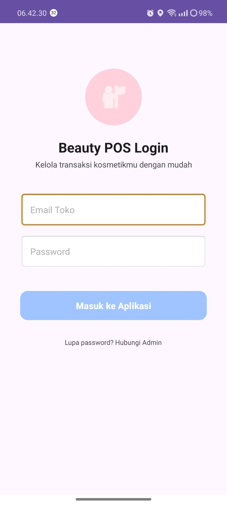

### Dashboard
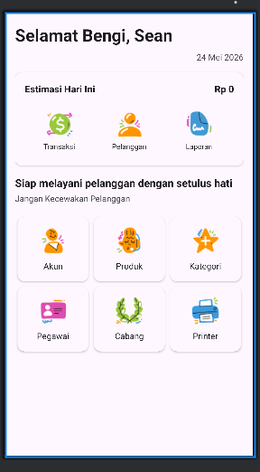

### Activity Transaksi
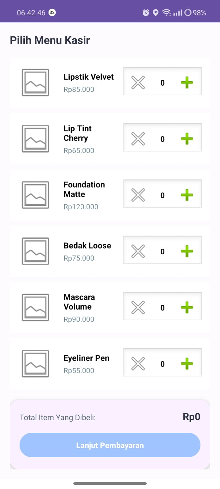

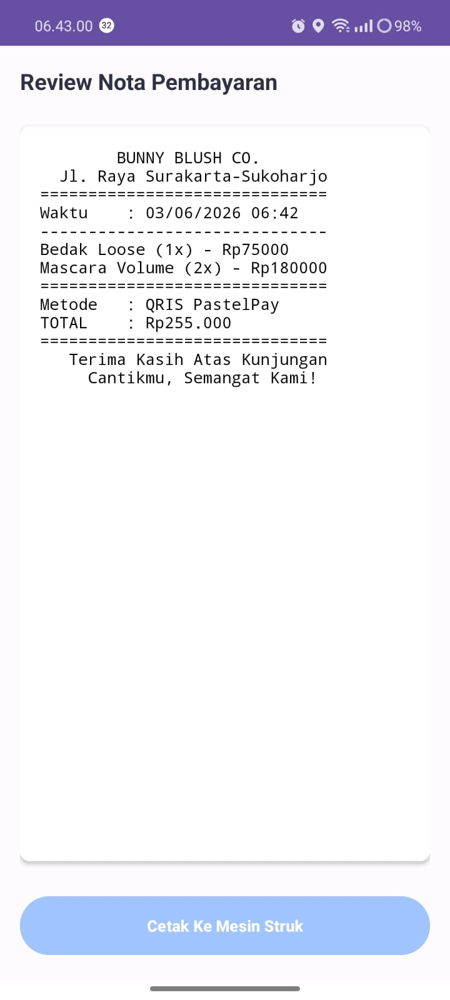

### Activity Pelanggan

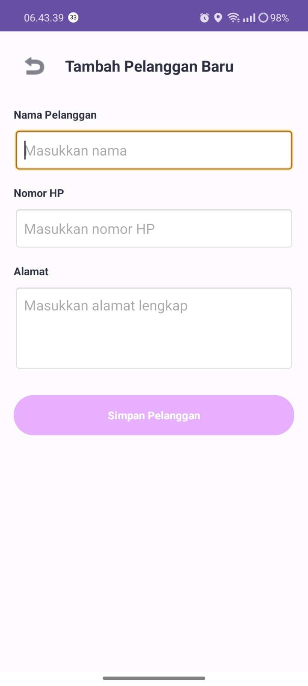

### Activity Laporan
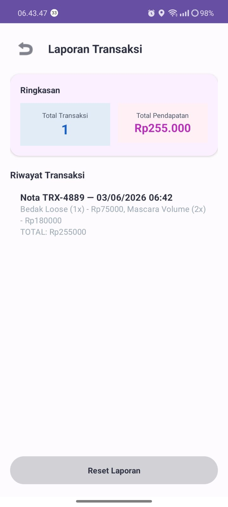

### Activity Akun
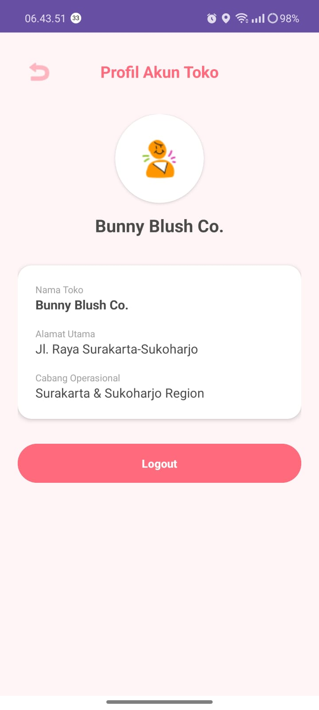

### Activity Produk
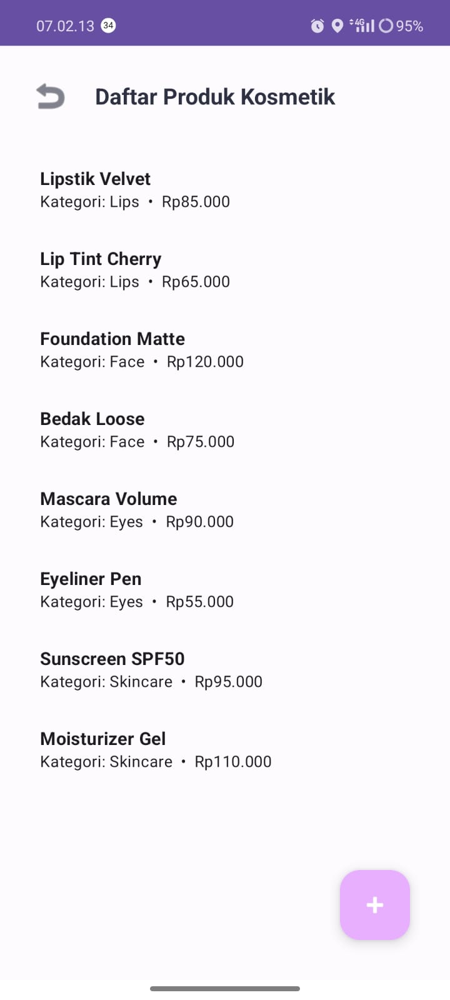
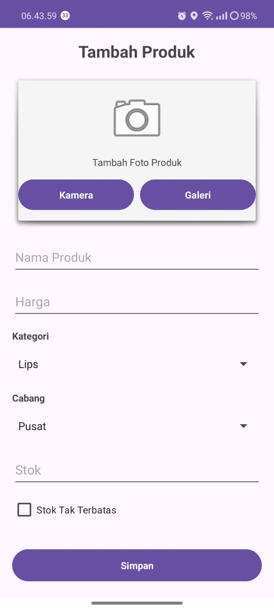

### Activity Kategori

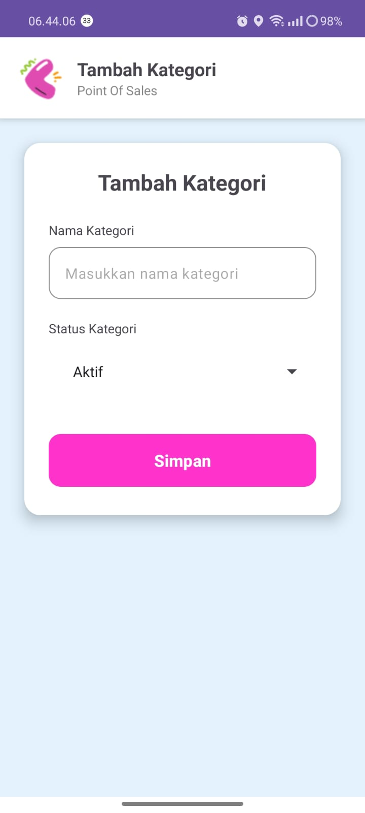

### Activity Pegawai

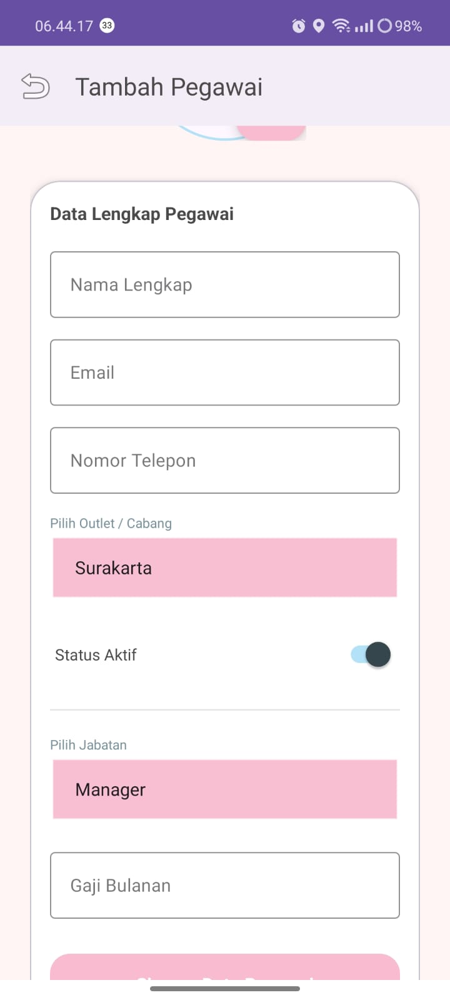

### Activity Cabang
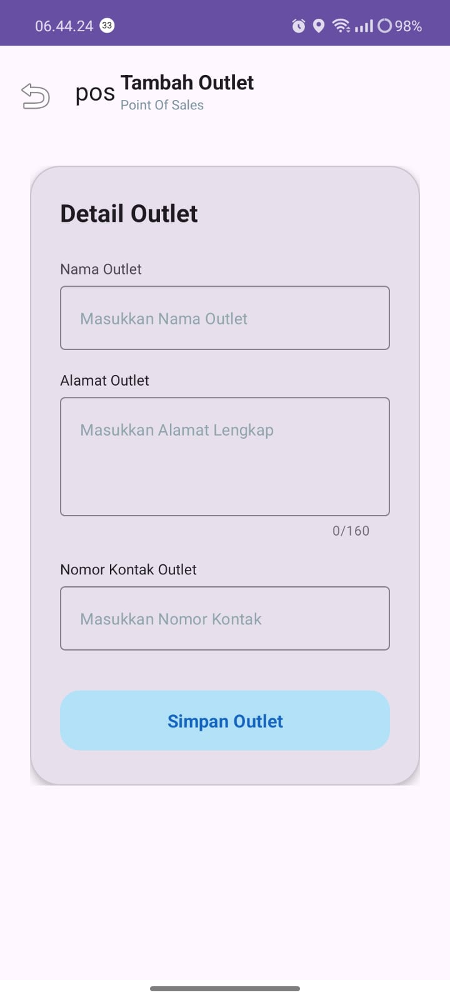

### Printer
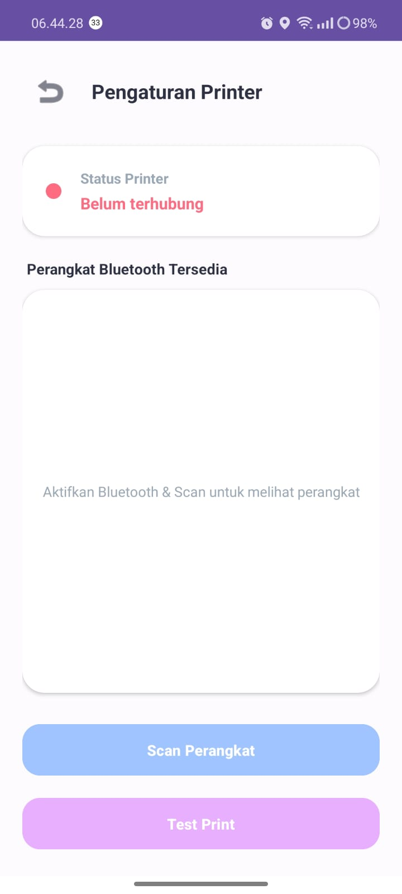

## Struktur Menu
- Dashboard
- Transaksi
- Pelanggan
- Laporan
- Akun
- Produk
- Kategori
- Pegawai
- Cabang
- Printer

## Cara Menjalankan Project
1. Clone repository
bash
2. git clone https://github.com/sandygifta-ui/kasir.git
3. Buka project menggunakan Android Studio
4. Tunggu proses Gradle selesai
5. Jalankan aplikasi menggunakan Emulator atau HP Android

## Kelebihan Aplikasi
Kelebihan dari Bunny Blush.co adalah tampilannya yang sederhana dan mudah digunakan sehingga 
pengguna dapat melakukan transaksi penjualan produk makeup dengan lebih cepat dan praktis. Aplikasi 
ini mampu menghitung total pembayaran secara otomatis, sehingga dapat mengurangi kesalahan 
perhitungan manual. Selain itu, data transaksi, pelanggan, produk, dan pegawai dapat disimpan 
dengan rapi sehingga memudahkan admin dalam mengelola dan melihat kembali riwayat penjualan. 
Aplikasi ini juga mendukung pengelolaan multi-cabang serta dilengkapi fitur laporan penjualan harian
yang membantu pemilik usaha memantau perkembangan bisnis kecantikannya. Bunny Blush.co ringan 
dijalankan di perangkat Android dan dapat dikembangkan lebih lanjut sesuai kebutuhan pengguna.